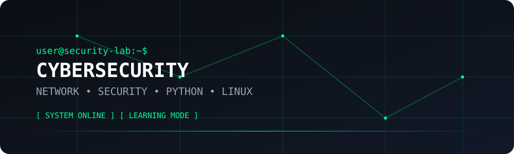

# Af

### Cybersecurity & Networking Student

`Network Security` • `Cybersecurity` • `Python` • `Linux`

---

<table>
<tr>
<td width="35%" align="center">

</td>

<td width="65%" align="left">

<h2>whoami</h2>

<pre>
USER        : Af
ROLE        : Computer Engineering Student
FIELD       : Cybersecurity & Networking

INTERESTS   : Network Security
              Ethical Hacking
              Penetration Testing
              Network Analysis
              Linux
              Security Tooling

LANGUAGES   : Python · C · C++
</pre>

</td>
</tr>
</table>

---

## `current_focus`

<table>
<tr>
<td width="50%" align="left">

<pre>
┌─[ NETWORK SECURITY ]
│
│  → TCP/IP
│  → Network Analysis
│  → Network Protocols
│  → Network Security
│
└──────────────────────
</pre>

</td>

<td width="50%" align="left">

<pre>
┌─[ CYBERSECURITY ]
│
│  → Ethical Hacking
│  → Penetration Testing
│  → Security Tools
│  → Vulnerability Analysis
│
└──────────────────────
</pre>

</td>
</tr>

<tr>
<td width="50%" align="left">

<pre>
┌─[ SYSTEMS ]
│
│  → Linux
│  → Kali Linux
│  → System Fundamentals
│  → Command Line
│
└──────────────────────
</pre>

</td>

<td width="50%" align="left">

<pre>
┌─[ SECURITY DEVELOPMENT ]
│
│  → Python
│  → Scapy
│  → Automation
│  → Security Tooling
│
└──────────────────────
</pre>

</td>
</tr>
</table>

---

## `toolbox`

<table align="center">
<tr>
<td align="center" width="250">

### 💻 Languages

`Python`  
`C`  
`C++`

</td>

<td align="center" width="250">

### 🌐 Networking

`TCP/IP`  
`Network Analysis`  
`Computer Networks`

</td>

<td align="center" width="250">

### 🛡️ Security

`Kali Linux`  
`Scapy`  
`Wireshark`

</td>
</tr>

<tr>
<td align="center" width="250">

### 🐧 Systems

`Linux`  
`Kali`  
`Windows`

</td>

<td align="center" width="250">

### ⚙️ Development

`Git`  
`GitHub`  
`Django`

</td>

<td align="center" width="250">

### 🗄️ Database

`SQL`  
`SQLite`  
`PostgreSQL`

</td>
</tr>
</table>
