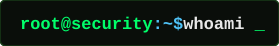
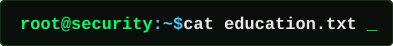
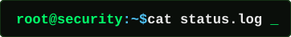
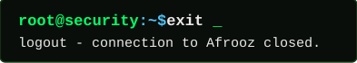

<div align="center">


<br>

</div>

<br>



```
Name       : Afrooz Behrooznick
Role       : Computer Engineering Student
Domain     : Computer Networks & Cybersecurity
Status     : Learning offensive security, one packet at a time
```

<br>



```
Degree     : B.Sc. in Computer Engineering (in progress)
Track      : Computer Networks & Information Security
Interests  : Penetration Testing, Network Defense, System Hardening
```

<br>



```
[OK]      CEH (Certified Ethical Hacker)
[OK]      Core development background — Python / C / C++
[OK]      Shifting focus from software development to practical cybersecurity
[RUNNING] Learning penetration testing & vulnerability assessment
[QUEUED]  Building practical cybersecurity projects

```

<br>


**Security**


**Programming**


**Web & Backend**


**Databases**


**Tools**


<br>


<div align="center">


<br>


</div>

<br>


<div align="center">

[](mailto:affro.nick.84@gmail.com)
[](https://t.me/Afrooz_Behrooznick)
[](https://linkedin.com/in/AfroozBehrooznick)

</div>

<br>


